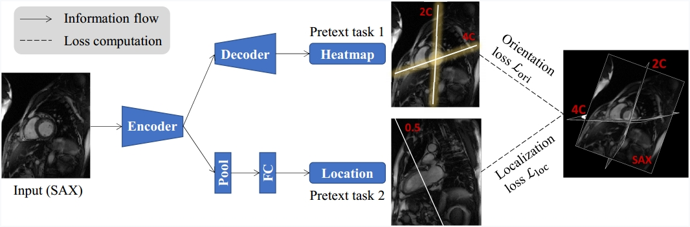

# Anatomy-Oriented-SSL

Code for paper "Self-Supervised Learning for Medical Image Data with Anatomy-Oriented Imaging Planes." （See fig below）



**Abstract.** Self-supervised learning has emerged as a powerful tool for pretraining deep networks on unlabeled data, prior to transfer learning of target tasks with limited annotation.
The relevance between the pretraining pretext and target tasks is crucial to the success
of transfer learning. Various pretext tasks have been proposed to utilize properties of
medical image data (e.g., three dimensionality), which are more relevant to medical image analysis than generic ones for natural images. However, previous work rarely paid
attention to data with anatomy-oriented imaging planes, e.g., standard cardiac magnetic resonance imaging views. As these imaging planes are defined according to the
anatomy of the imaged organ, pretext tasks effectively exploiting this information can
pretrain the networks to gain knowledge on the organ of interest. In this work, we propose two complementary pretext tasks for this group of medical image data based on the
spatial relationship of the imaging planes. The first is to learn the relative orientation
between the imaging planes and implemented as regressing their intersecting lines. The
second exploits parallel imaging planes to regress their relative slice locations within a
stack. Both pretext tasks are conceptually straightforward and easy to implement, and
can be combined in multitask learning for better representation learning. Thorough experiments on two anatomical structures (heart and knee) and representative target tasks
(semantic segmentation and classification) demonstrate that the proposed pretext tasks
are effective in pretraining deep networks for remarkably boosted performance on the
target tasks, and superior to other recent approaches.

## Datasets

1.  Data Science Bowl Cardiac Challenge (DSBCC) dataset: https://www.kaggle.com/c/second-annual-data-science-bowl/data
2.  Automated Cardiac Diagnosis Challenge (ACDC) dataset: https://www.creatis.insa-lyon.fr/Challenge/acdc/databases.html

## Introduce


## Cite Anatomy-Oriented-SSL

```
@article{zhang2024self,
  title={Self-supervised learning for medical image data with anatomy-oriented imaging planes},
  author={Zhang, Tianwei and Wei, Dong and Zhu, Mengmeng and Gu, Shi and Zheng, Yefeng},
  journal={Medical Image Analysis},
  pages={103151},
  year={2024},
  publisher={Elsevier}
}
```

## Contact

If you have any questions, please do not hesitate to contact [gsbyztw@163.com](mailto:gsbyztw@163.com)
